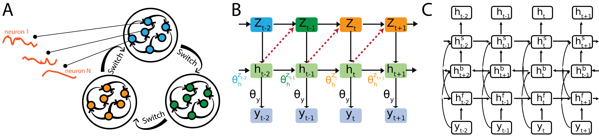

# SRNN — Switching Recurrent Neural Networks

[](https://openreview.net/pdf?id=zb8jLAh2VN)
[](LICENSE)

Official implementation of **Switching Recurrent Neural Networks (SRNNs)** — a model class that combines the expressivity of RNNs with the interpretable regime structure of switching state-space models, enabling inference of discrete dynamical regimes underlying neural activity.

> **Inference of Neural Dynamics Using Switching Recurrent Neural Networks**
> Yongxu Zhang, Shreya Saxena.
> *Advances in Neural Information Processing Systems (NeurIPS)*, 2024.
> [[paper]](https://openreview.net/pdf?id=zb8jLAh2VN)



## What's in this repo

| Path | What it contains |
|------|------------------|
| `SRNN/` | Core SRNN model implementation (`model_srnn.py`), inference network, EM training loop, and utilities. |
| `ssm/` | Vendored state-space-model helpers used by the demos. |
| `0_demo_lorenz*.ipynb` | Walk-through notebooks fitting an SRNN to a Lorenz attractor under different initializations. |
| `1_demo_lorenz.py` | Same Lorenz demo as a runnable script. |
| `1_demo_analysis.ipynb` | Post-fit analysis of inferred switching regimes. |
| `2_demo_area2_single.ipynb` | Single-trial demo for [area2 bump data] (https://elifesciences.org/articles/48198) from [neural latent benchmark](https://github.com/neurallatents/neurallatents.github.io/blob/master/notebooks/area2_bump.ipynb). |
| `2_demo_analysis_area2.ipynb` | Post-fit analysis of inferred switching regimes for single-trial model. |
| `environment_srnn.yml` | Conda environment specification. |

## Installation

```bash
git clone https://github.com/saxenalab-neuro/SRNN.git
cd SRNN
conda env create --file environment_srnn.yml
conda activate SwitchingRNN
```

If the environment build fails on your platform, `pip install` any reported missing packages — they are all common scientific-Python dependencies.

## Quick start

Run the Lorenz-attractor demo end-to-end:

```bash
python 1_demo_lorenz.py
```

Or work through the demo interactively:

```bash
jupyter notebook 0_demo_lorenz.ipynb
```

For analysis of a fitted model (inferred regimes, switching dynamics, reconstructions), open `1_demo_analysis.ipynb`.


## Model fit on single-trial data

Run the demo for single-trial data: [area2 bump data] (https://elifesciences.org/articles/48198):

```bash
jupyter notebook 2_demo_area2_single.ipynb
```

For analysis of a fitted model , open `2_demo_analysis_area2.ipynb`.

## Citation

If you use SRNN in your research, please cite:

```bibtex
@inproceedings{zhang2024srnn,
  title     = {Inference of Neural Dynamics Using Switching Recurrent Neural Networks},
  author    = {Zhang, Yongxu and Saxena, Shreya},
  booktitle = {Advances in Neural Information Processing Systems (NeurIPS)},
  year      = {2024},
  url       = {https://openreview.net/pdf?id=zb8jLAh2VN}
}
```

A `CITATION.cff` is included so you can also click *"Cite this repository"* on GitHub.

## License

[MIT](LICENSE) © Saxena Lab, Yale University.

## Acknowledgements

Developed in the [Saxena Lab for Neural Control](https://www.saxenalab.org) at Yale University. See the [lab GitHub organization](https://github.com/saxenalab-neuro) for related tools (mRNNTorch, RNNToolkit, muSim).
